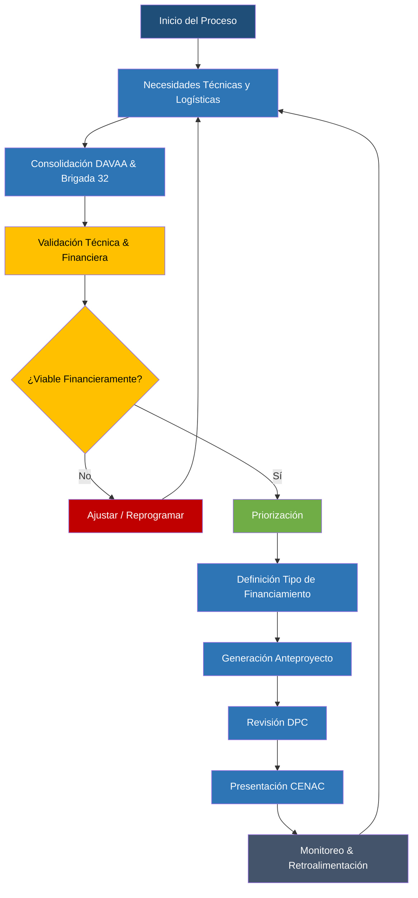

# MODELO DE GESTIÓN DE RECURSOS  
## Sistema UH-60  
### Ejército Nacional de Colombia

```mermaid
flowchart TD

A[Inicio del Proceso]:::inicio --> B[Necesidades Técnicas y Logísticas]:::proceso
B --> C[Consolidación DAVAA & Brigada 32]:::proceso
C --> D[Validación Técnica & Financiera]:::decision
D --> E{¿Viable Financieramente?}:::decision

E -- No --> F[Ajustar / Reprogramar]:::alerta
F --> B

E -- Sí --> G[Priorización]:::estrategico
G --> H[Definición Tipo de Financiamiento]:::proceso
H --> I[Generación Anteproyecto]:::proceso
I --> J[Revisión DPC]:::proceso
J --> K[Presentación CENAC]:::proceso
K --> L[Monitoreo & Retroalimentación]:::control
L --> B

classDef inicio fill:#1f4e79,color:#fff;
classDef proceso fill:#2e75b6,color:#fff;
classDef decision fill:#ffc000,color:#000;
classDef alerta fill:#c00000,color:#fff;
classDef estrategico fill:#70ad47,color:#fff;
classDef control fill:#44546a,color:#fff;
```
