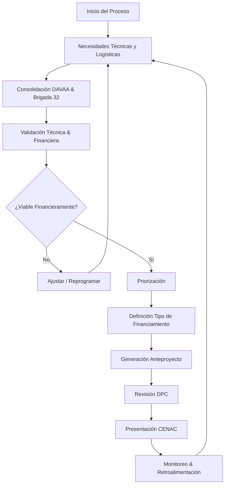

# Gestión de Recursos – UH-60

## Flujograma del Proceso

```mermaid
flowchart TD

A[Inicio del Proceso] --> B[Necesidades Técnicas y Logísticas]
B --> C[Consolidación DAVAA & Brigada 32]
C --> D[Validación Técnica & Financiera]
D --> E{¿Viable Financieramente?}

E -- No --> F[Ajustar / Reprogramar]
F --> B

E -- Sí --> G[Priorización]
G --> H[Definición Tipo de Financiamiento]
H --> I[Generación Anteproyecto]
I --> J[Revisión DPC]
J --> K[Presentación CENAC]
K --> L[Monitoreo & Retroalimentación]
L --> B
```
